# 🍂 Autumn OS: Peak Fall Edition

<div align="center">
  
  
  
  ### Next.js Craftsman | Northern Michigan 🌲
  
  *Building fast, modern websites with a focus on*  
  **performance** • **automation** • **clean design**
  
  [](https://www.cherrycapitalweb.com/)
  [](https://github.com/thuggys)
  [](mailto:contact@cherrycapitalweb.com)
  
</div>

---

## 🚀 What I Do

```typescript
const thuggys = {
  code: ["TypeScript", "JavaScript", "Python", "SQL"],
  frameworks: ["Next.js 15", "React", "Node.js"],
  design: ["Tailwind CSS", "shadcn/ui", "Framer Motion"],
  databases: ["PostgreSQL", "Prisma", "Redis", "Firebase"],
  cloud: ["Vercel", "Cloudflare", "Edge Functions"],
  automation: ["Playwright", "Puppeteer", "BeautifulSoup"],
  currentFocus: "React Server Components & Edge Computing"
};
```

<div align="center">

### ⚡ React Server Components • 🐍 Python Automation • 🎨 Modern UI/UX • ☁️ Edge-First Architecture

</div>

---

## 🛠️ Tech Stack

<div align="center">

### Frontend


### Backend & Database


### DevOps & Automation


</div>

---

## 📌 Highlights

<div align="center">

<table>
<tr>
<td align="center" width="33%">

<br/>
<b>Lighthouse Scores</b>
<br/>
<sub>on client projects</sub>
</td>
<td align="center" width="33%">

<br/>
<b>Edge Rendered</b>
<br/>
<sub>streaming UI experiences</sub>
</td>
<td align="center" width="33%">

<br/>
<b>Automated Pipelines</b>
<br/>
<sub>OG images + SEO</sub>
</td>
</tr>
</table>

</div>

---

## 💼 Services

<details>
<summary><b>⚡ Performance Optimization</b></summary>
<br/>

- Server-side rendering with Next.js 15
- Edge function deployment
- Strategic caching with Redis
- Image optimization & lazy loading
- Core Web Vitals tuning

</details>

<details>
<summary><b>🎨 Modern UI Development</b></summary>
<br/>

- Component-based architecture with React
- Responsive design with Tailwind CSS
- Accessible, semantic HTML
- Smooth animations with Framer Motion
- Design system implementation (shadcn/ui)

</details>

<details>
<summary><b>🤖 Automation & Scripting</b></summary>
<br/>

- Web scraping with Python
- Automated testing with Playwright
- CI/CD pipeline setup
- Data processing workflows
- SEO metadata generation

</details>

<details>
<summary><b>☁️ Cloud & Infrastructure</b></summary>
<br/>

- Vercel deployment & optimization
- Cloudflare edge configuration
- Database design & migration
- API development
- Performance monitoring

</details>

---

## 📊 GitHub Stats

<div align="center">
  
  
  
  

</div>

---

## 🎯 Current Focus

```mermaid
graph LR
    A[Next.js 15] --> B[React Server Components]
    B --> C[Edge Computing]
    C --> D[Performance]
    D --> E[User Experience]
    E --> F[🚀 Shipped!]
    
    style A fill:#FF6B35
    style B fill:#FF8C42
    style C fill:#FFAD4F
    style D fill:#FFCE5C
    style E fill:#FFE969
    style F fill:#4CAF50
```



---

## 📬 Let's Connect

<div align="center">

### Open to new projects — always shipping! 🚢

[](https://www.cherrycapitalweb.com/)
[](https://github.com/thuggys)
[](mailto:contact@cherrycapitalweb.com)

</div>

---

<div align="center">

### 🌲 Built with love in Northern Michigan


**⭐ Star my repos if you find them useful!**

</div>

---

<div align="center">
  
  
  
</div>
